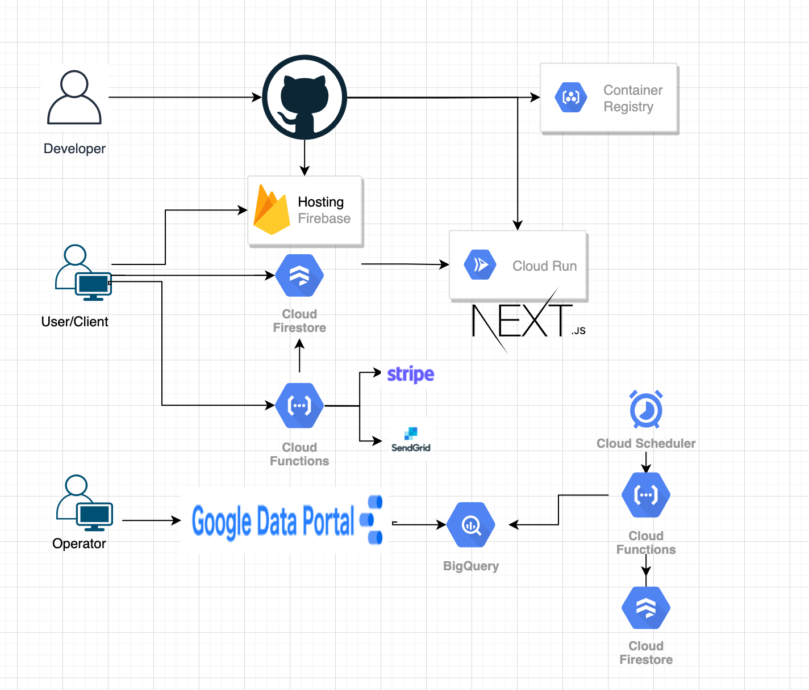

# Firebase,Cloud Run を使ってサービスリリースした話

## 株式会社コクリ @chocopie116

---

# メッセージ

フルマネージド環境最高。いろんな不足を補ってくれる。

- スキル・職能の不足
- 開発リソースの不足

一方制約もあるので要件に応じて要件に応じた判断が必要。

---

# 自己紹介

- 株式会社コクリ 代表(エンジニア絶賛募集中)
- 2020 年札幌移住(東京から U ターン)
- 電動キックボード販売事業もしてます。
- 子ども 3 歳(♀)と 0 歳(♀)の 2 児の父

---

# 自分の趣向/得意の傾向

- アプリケーションエンジニア > インフラエンジニア
- バックエンドエンジニア > フロントエンドエンジニア
- 静的型付け言語 > 動的型付け言語
- 事業・サービス > 技術
- 広く浅く > 狭く深く
- 0→1 開発 > 1→100 開発

---

# 本題

フルマネージドサービスとは

---

# フルマネージドサービスとは

- クラウドサービスで利用者が管理しなければいけない範囲を、クラウドサービス提供者がよしなにやってくれるサービス

---

# メリット/デメリット

- (+) インフラサービスでいうと、監視・オートスケール・障害対応等の不安から開放
- (-) インフラサービスでいうと、自分でカスタマイズしてきた人からすると制約が多い
- (-) 実装上の制約があったりする

自分は 0→1 のサービス開発が多いので積極的に採用。

---

# 今回のお題のサービス

とある会員向けサービスで、zoom 英会話を促すサービス。

- ユーザーはアカウントをつくれる
- ユーザーは定期課金をつくれる
- ユーザーはミーティング候補をつくれる
- ユーザーは他のユーザーのミーティング候補に申し込みできる

---

# 採用した構成要素

- インフラ的なもの
  - Firebase Authentication(認証)
  - Cloud Firestore(データストア)
  - Cloud Functions(Function as a Service)
  - Cloud Run(コンテナ)
- アプリケーション的なもの
  - Next.js/React.js/TypeScript(Frontend)
  - Node.js/TypeScript(Backend)

---

##### 構成管理図

---

# Cloud Firestore(データストア)

- (+) js-sdk で直接フロントエンドから利用することでバックエンド開発が不要に。
- (+) 各種言語の SDK が充実してる
- (+) NoSQL ベースだがクエリが書ける
- (-) 集計が苦手(join, groupby 等使えない)
- (-) データベースの制約がつくれない(RDB のユニーク制約...etc)
- (-) セキュリティ気をつけないといけない

---

# Cloud Firestore の使い所/問題と工夫

- [使い所] 新規開発であって、データベースが硬くないシステムであれば積極的に採用()
- [問題] 集計が苦手
  - クエリで部分集合とってきて、アプリケーションで処理する
  - 管理画面の集計なら BigQuery にいれて参照する(Google Data Portal で簡易ダッシュボード)
- [問題] セキュリティ気をつけないといけない
  - security rules を利用/テストを書く
  - バックエンド API を構築し client から直接接続しない

---

## Cloud Functions(FaaS)

- (+) サーバー管理不要
- (+) Firebase Authentication を使えば認証の実装も楽になる。
- (-) コールドスタート時の起動が遅い
- (-) デプロイ時間かかるし、よくこけるのでイライラ MAX

---

# Cloud Functions の使い所/工夫

- [使い所] js コードに含むことのできない secret を扱う(stripe, sendgrid...etc)
- [使い所] WAF を使うまでもない小さな Functions を扱いたい時
- [問題] デプロイ時間かかるし、よくこけるのでイライラ MAX
  - CD しない w

---

## Cloud Run(コンテナ)

- (+) サーバー管理不要で設定がめちゃくちゃ簡単
- (+) フルマネージドコンテナなのに、従量課金制で安い
- (-) 常時起動プロセスは無理なので工夫が必要。
- (-) 60 分でタイムアウト(scheduler 使って、重いバッチ処理をする場合)

---

## Cloud Run の使い所/工夫

- [使い所] 積極的に採用。
- [問題] 常時起動プロセスは無理なので工夫が必要。
  - バッチ処理は cloud schedluer 使って http で外から叩く

このあたりはどんどんサービス更新入っているので楽しみ

---

# Thank you

- twitter @chocopie116 で絡んでください。
- ['サウナ', 'キャンプ', 'パパ'].map(s => console.log(`${s}友達募集中`))
