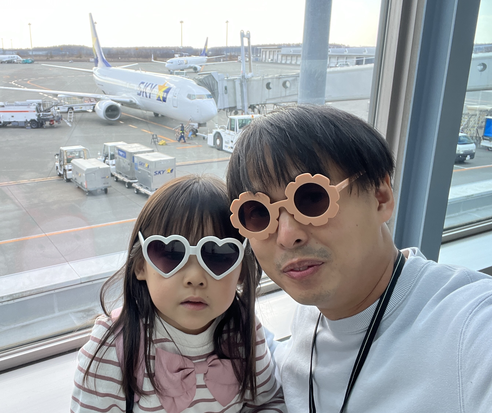
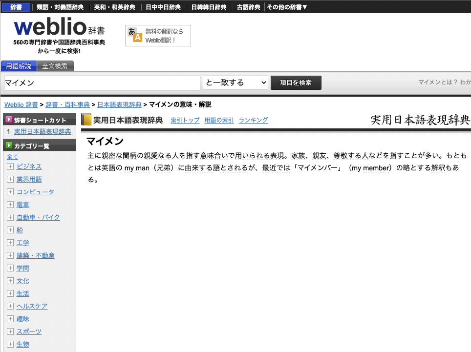
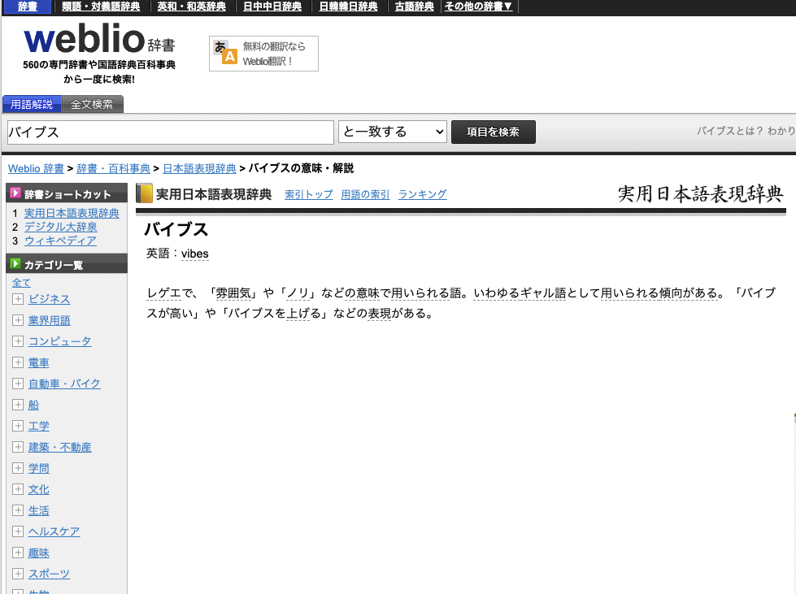
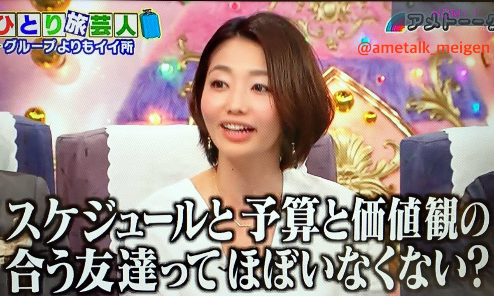
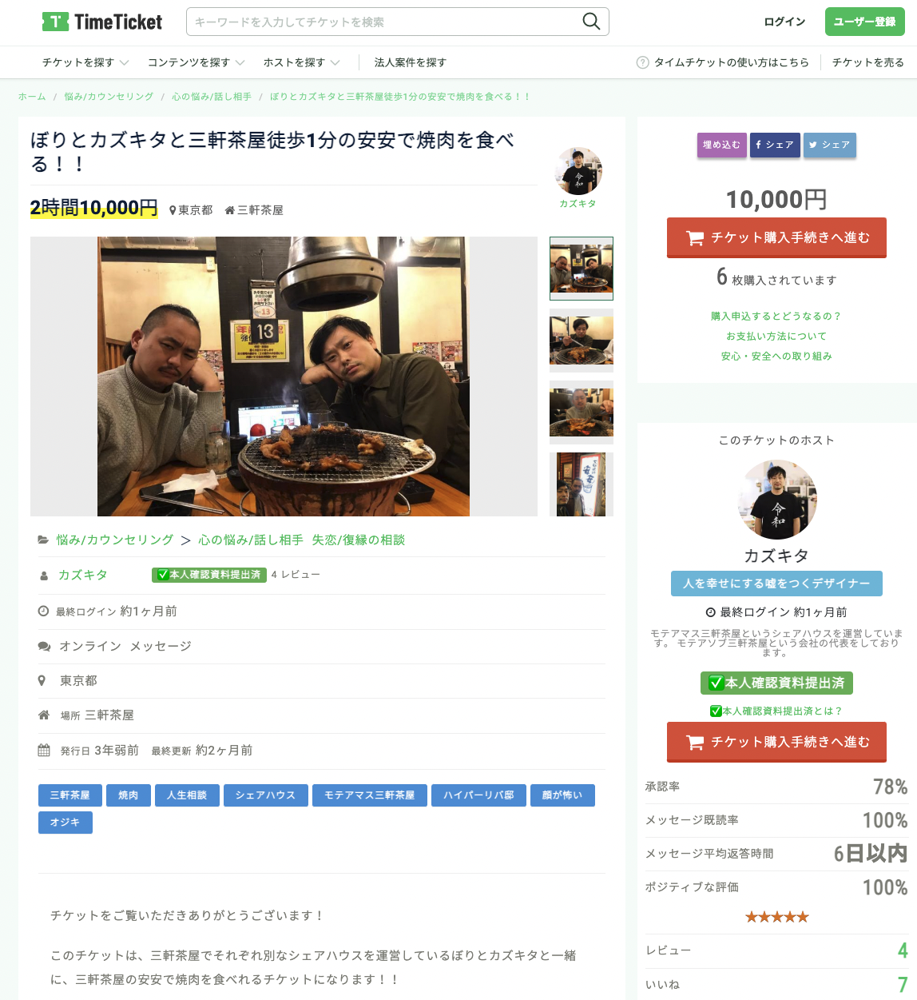
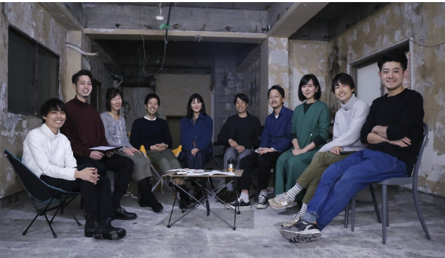
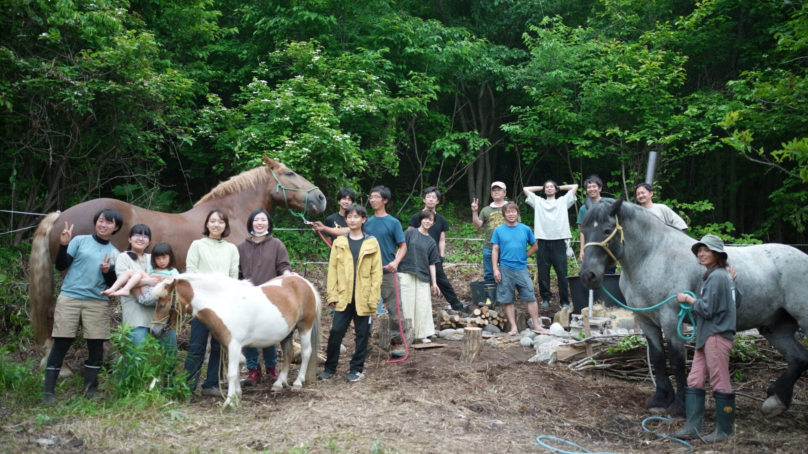

# バイブス高まるマイメンとの出会い方

## 株式会社コクリ @chocopie116

---
# 突然ですが

---

# バイブス高まるマイメンと出会えてますか？

---

---

# 自己紹介

- 株式会社コクリ 代表
- 2020 年札幌移住(東京から U ターン)
- 電動キックボード販売事業もしてます。
- 子ども 5 歳(♀)と 2 歳(♀)の 2 児の父

---

# マイメンとは？

---

---

# バイブスとは？

---

---

# ノリの合うお友達
# 
# 
# 
# 
# 
# 
# 
# 
# 
# 
# 

---

# 自分にとって心地の良いノリの合う友達とは

- 好奇心 = 何でも面白がれる
- 暇 = 個人の裁量で休みを調整できる
- DIY = サービス利用者より、サービス提供者に関心がある
- フッ軽 = よくわからないけど行動に移す
---

# 貴重なお友達との出会い方を振り返る

#
#

- 三茶ジャパン(勝手に焼肉安安に連れて行くおじさんアイドルユニット)
- 三茶WORK(三軒茶屋コワーキングスペース)
- ペンギンガレージ(フリーランスコミュニティ)
#
#
#

---

# 大事そうなこと
## 自分 ↔ 相手がお互いにとって特別だと認識すること。
---
# 食パンくわえて曲がり角衝突理論
# 
# 
# 
# 
# 
# 
# 
# 
# 
#
# 

---

# 三茶ジャパン
# 
# 
# 
# 
# 
# 
# 
# 
# 
# 
# 
# 

---
# インターン一緒にしたらズッ友理論
# 
# 
# 
# 
# 
# 
# 
# 
# 
# 
 

---

# 三茶WORK
# 
# 
# 
# 
# 
# 
# 
# 
# 
# 

---

# タイムマシン友達理論
# 
# 
# 
# 
# 
# 
# 
# 
# 
# 
# 
 

---

# ペンギンガレージ
# 
# 
# 
# 
# 
# 
# 
# 

---

# まとめ
- お互いが特別だと認識しやすい出会い方をする
- お互いが特別だと思う体験を一緒にする
- 仲良くないとやらないことをする→仲良くなる

