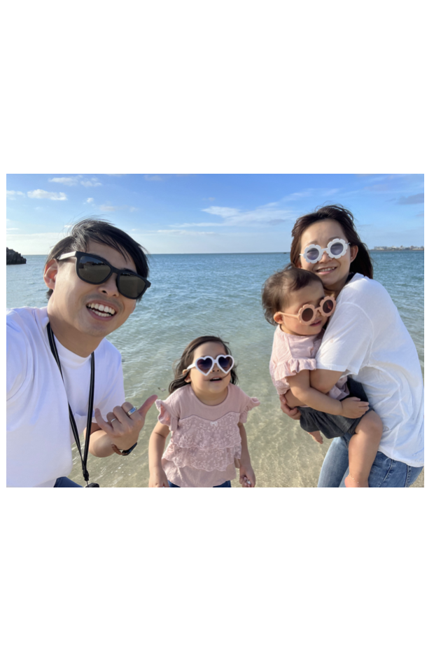
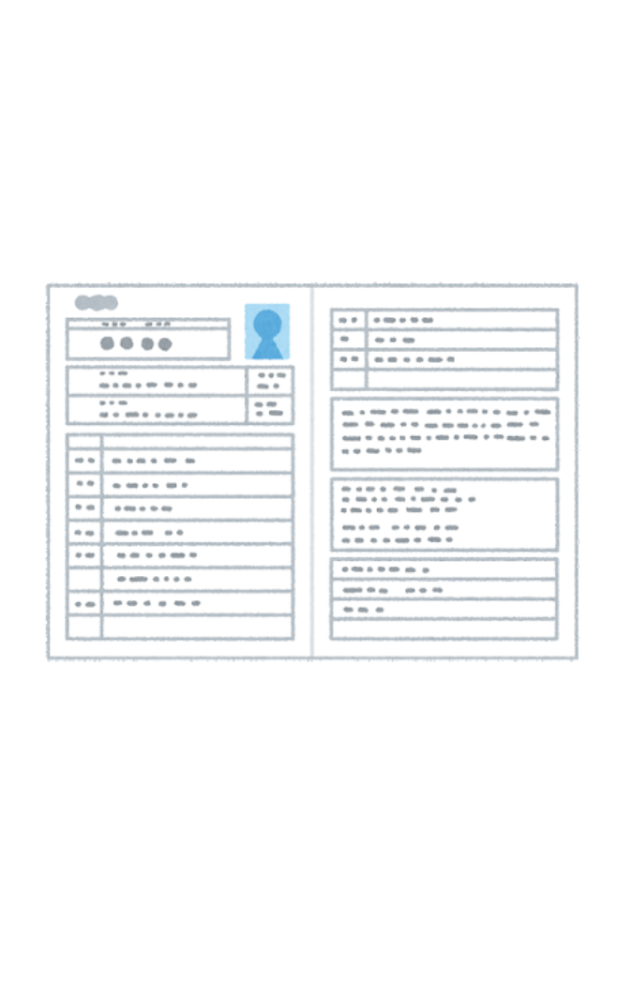

<!-- 
_color: white
-->

# なんとなくで始めた芸歴11年目のエンジニアの自己紹介

## @chocopie116

---
# [質問]

### エンジニアってどんなイメージですか?

---

# ・・・
---

# 自己紹介LTのゴール
- 皆さんが自分の将来を考える上で1つの人生のサンプルになる
- 良いマッチングにつながったらラッキー

---
# [質問]

### エンジニアってどんなイメージですか?

---

# へぇ〜、なるほど〜がゴール。

---
# 今日はなすこと
- なぜエンジニアになったか
- いまどんな仕事してるか
- 何を考えてエンジニアしてるか
- 他のメンターと比較した特徴

---

# 自己紹介

- 北海道出身、就職で東京
- 新卒からエンジニアを勉強
- 3年前にUターン
- 妻・5歳と2歳の娘可愛い🥰
- 受託開発/電動キックボード販売の仕事してます

---

### なぜエンジニアになったか
- ①地元就職→東京就職
- ②コンサルタント→ITベンチャー
- ③ビジネス職→エンジニア職

---
# 経歴
- 2012年 新卒入社
- 2019年 個人事業主独立
- 2020年 SWALLOW合同会社創業
- 2020年 株式会社コクリ創業

---

# ここで水を飲む

#### (さりげなく時計を確認)

---

### いまどんな仕事してるか
- 絵画を販売する会社のデジタル化
- オフィス設計の会社の新商材開発
- 監査法人の業務効率SaaSの開発
- 電動キックボードの販売事業

---

### 何を考えてエンジニアしてるか
- 解決すべき課題は何かを大事にする
- 解決すべき課題は、顧客から考える
- プログラミングは、仮説検証の手段

---

### 他のメンターと比較したちがい
- 色々な会社の事業の話を知ってる
- いいね！って無責任にたくさん言う
- 技術的には器用貧乏(広く浅く)

---
## どんなお手伝いができるか

| STEP1 | ◎STEP2 | ◎STEP3 |
| :--- | :---: | ---: |
| canプログラミング| canプロダクト| can事業・サービス |

---
## 外国語に置き換えると

| STEP1 | STEP2 | STEP3 |
| :--- | :---: | ---: |
| can読み書き| canコミュニケーション| can仕事 |

---

### 芸歴11年目からのマウンティング
- 言語/FWの最適を悩むのは無駄
- 目の前の人の役に立つ努力
- 努力は夢中にかなわない

---

<!-- 
_color: white
-->

# Thank You.

##### なんとなくで始めた芸歴11年目のエンジニアの自己紹介

