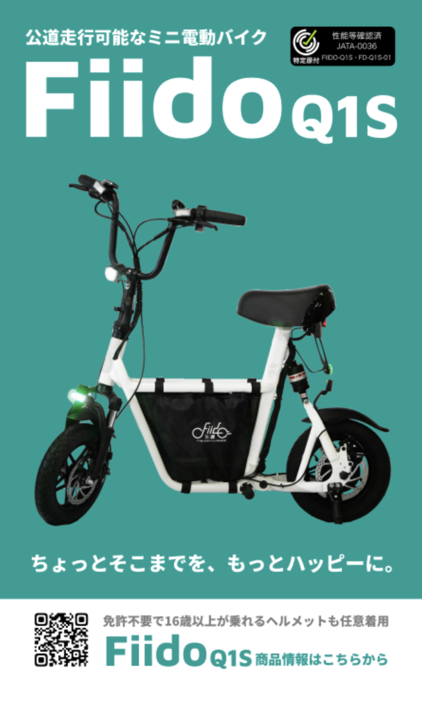
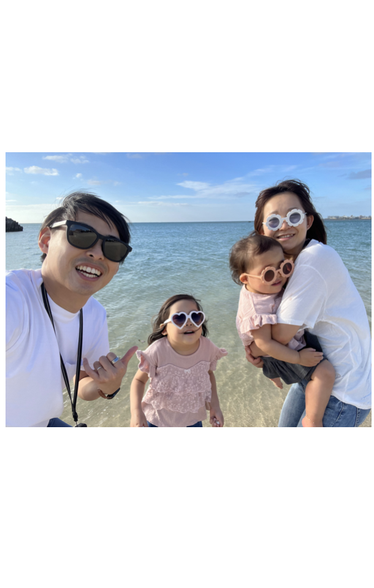
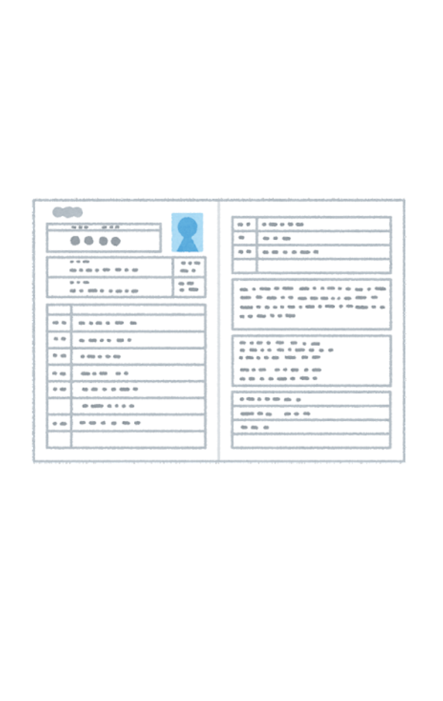
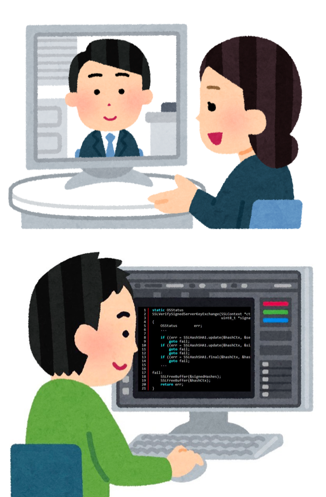
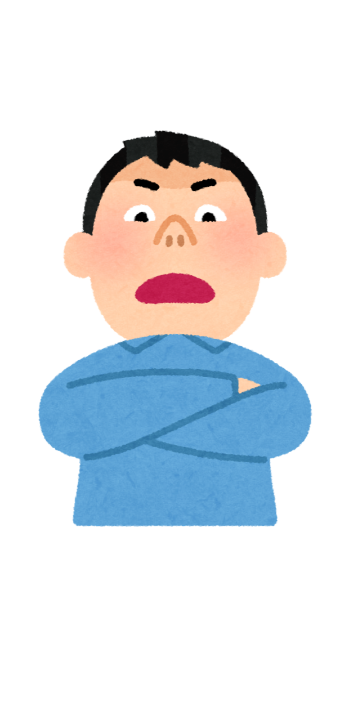

<!--
_color: white
-->

# 芸歴12年のエンジニアの生態

## @chocopie116

---

# [質問]

### エンジニアってどんなイメージですか?

---

# ・・・

---

### プリンターつくれる?
### バイクつくれる？
### システムつくれる?

---

# ゴール

- 多様なキャリアの1つの参考に。
- 良い出会いがあれば。

---

# [質問]

### エンジニアってどんなイメージですか?

---

# 今日はなすこと

- なぜエンジニアになったか
- いまどんな仕事してるか
- 何を考えてエンジニアしてるか
- 他のメンターと比較した特徴

---

# 自己紹介

- 北海道出身、就職で東京
- 新卒でエンジニア
- 7年会社員・独立5年
- 3年前にUターン
- 妻・6歳と3歳の娘可愛い
- BtoB専門受託開発/電動キックボード販売の仕事

---

### なぜエンジニアになったか(就活変遷)

- ① 地元就職 → 東京就職
- ② コンサルタント →IT ベンチャー
- ③ ビジネス職 → エンジニア職
  

---

# 経歴

- 2012 年 VOYAGE GROUP(現: CALTA HOLDING)入社
- 2019 年 個人事業主独立
- 2020 年 SWALLOW 合同会社創業
- 2020 年 株式会社コクリ創業
  

---

# ここで水を飲む

#### (さりげなく時計を確認)

---

### いまどんな仕事してるか

- 監査法人の業務効率 SaaS の開発
- スポーツクラブのファンクラブの運営
- 絵画を販売する会社のデジタル化
- 電動キックボード/電動バイクの販売事業

---

#### 何を大事にエンジニアしてるか

- なぜからはじめる
- 顧客からはじめる
- 小さくはじめる

---

#### 他のメンターと比較したちがい

- 独立して小さいチームで動いている
- 技術的 器用貧乏(広く浅く)
- いいね！と無責任にたくさん言う

---

## どんなお手伝いができるか

| STEP1              |     ◎STEP2     |             ◎STEP3 |
| :----------------- | :------------: | -----------------: |
| プログラミング◯ | プロダクト◯ | 事業・サービス◯ |

---

## 外国語に置き換えると

| STEP1        |         STEP2          |    STEP3 |
| :----------- | :--------------------: | -------: |
| 読み書き◯ | 日常会話◯| 仕事◯ |

---

##### 芸歴12年目からのマウンティング

- 正しさ/最適化を追い求めすぎない
- 努力は夢中にかなわない

---

<!--
_color: white
-->

# Thank You.

